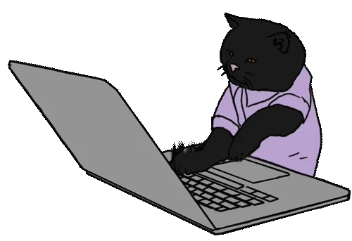

<h1 align="Center">  Hey man  ! I'm  Doctxing  </h1>

I'm a student who is passionate about learning math, writing code, reversing things, and building hardware.

- 🔭 I’m currently a student at Harbin Institute Of Technology (Shenzhen)
- ⚡️ Familiar with several programming languages, but hard to pick a favorite
- 🎮 Games: Minecraft & Adofai
- 📫 How to reach me: [email](mailto:b64decode(b'ZG9jdHhpbmdAb3V0bG9vay5jb20='))

## Some Stats About Me (Public)

  <picture>
    <source
      srcset="https://github-readme-streak-stats-kappa-three.vercel.app?user=doctxing&theme=github-dark-blue"
      media="(prefers-color-scheme: dark)"
    />
    <source
      srcset="https://github-readme-streak-stats-kappa-three.vercel.app?user=doctxing&theme=github-light"
      media="(prefers-color-scheme: light), (prefers-color-scheme: no-preference)"
    />
    
  </picture>

<picture>
  <source media="(prefers-color-scheme: dark)" srcset="https://github.com/Doctxing/doctxing/blob/output/github-snake-dark.svg" />
  <source media="(prefers-color-scheme: light)" srcset="https://github.com/Doctxing/doctxing/blob/output/github-snake.svg" />
  
</picture>
